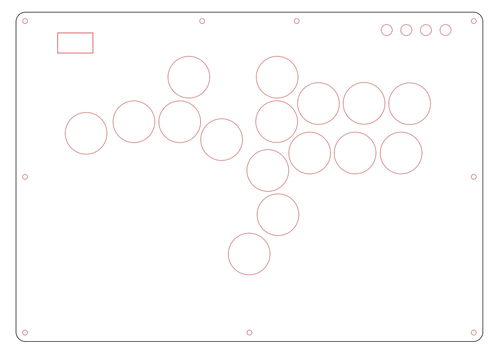

# DuelPad A16 Firmware

Thanks to [OpenStickCommunity GP2040-CE](https://github.com/OpenStickCommunity/GP2040-CE) software to design your own fighting keyboard, making it possible for the market to have access to very affordable fighting keyboards.This approach will allow more people to have access to affordable fighting keyboards, thus driving the development of the entire industry. The DuelPad team will continue to open-source the software and hardware of the fighting keyboard. We hope that you can provide valuable feedback.
## Some of the cool things:
The A16 Fight Keyboard has some cool features such as DPAD selection, SOCD selection, competitive Focus mode, RGB lighting, 16-key layout, ergonomic design, USB passthrough port, which, when paired with a security dongle, supports PS4, PS5, and XBOX ONE game consoles. It comes with a transparent acrylic panel the size of an A4 paper, allowing players to print their favorite customized panels.

## Hardware Schematic
The DuelPad A16 hardware schematic is as follows. You can customize your key values using GP2040-CE web according to your requirements.

## Customize Your Own Artwork 
Print out your favorite art based on this blueprint and replace it with the existing one.
[Download](https://www.duelpad.com/wp-content/uploads/2024/03/Duelpad-cross-a16.pdf)

## 📚 Documentation
More extensive documentation including ordering and USER guides is available at [**Duelpad Official website**](www.duelpad.com).

## Need help?
Open a GitHub discussion

## TO DO
Open source hardware . coming soon...